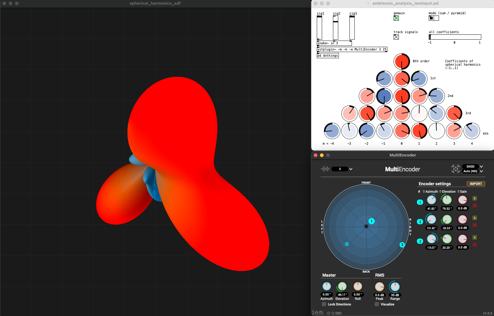
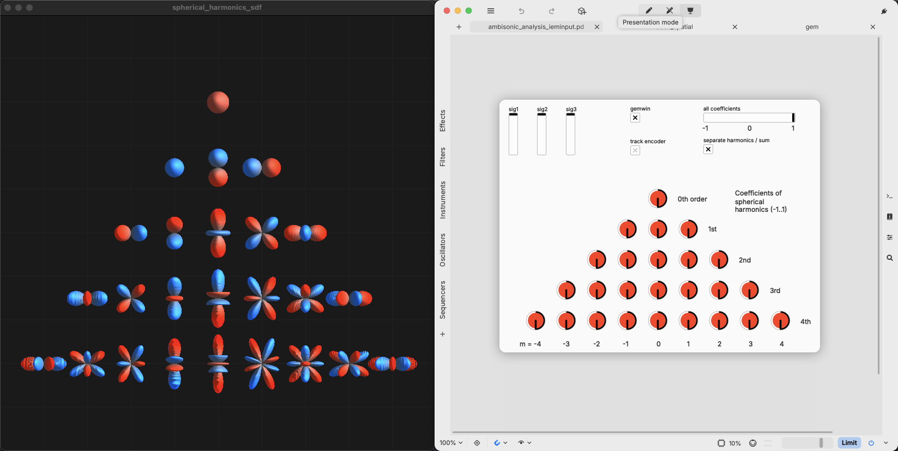

# Visualizing spherical harmonics
Experiment with Pd (Pure Data) to display spherical harmonics of ambisonic signal

Based on a (stolen) fragment shader in Gem to display the spherical harmonics of IEM's MultiEncoder.
The shader code was customized quite a bit for this use case and became quite a mess (the original one is clean and well documented - so i'll take all the blame). Also the patch could certainly be cleaner and is partly slightly brute-forced.

Tested on MacOS arm64 with Pd0.55-1 and plugdata nightly build 4f40edd68

> [!WARNING]  
> It's a known issue here that Pd will crash if you start the gemwin from the patch without previously opening a gemwin from another context (like a Gem example or gemwin help) - see https://github.com/umlaeute/Gem/issues/452

### Dependencies

* Gem (available on Deken)
* vstplugin~ (available on Deken)
* IEM MultiEncoder - see plugins at https://plugins.iem.at/

